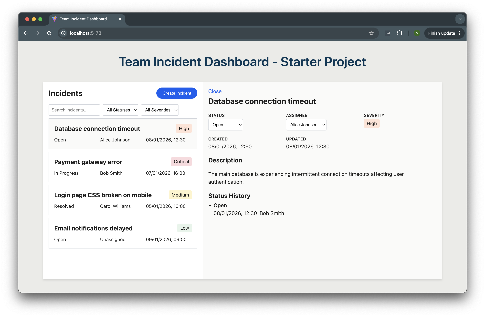
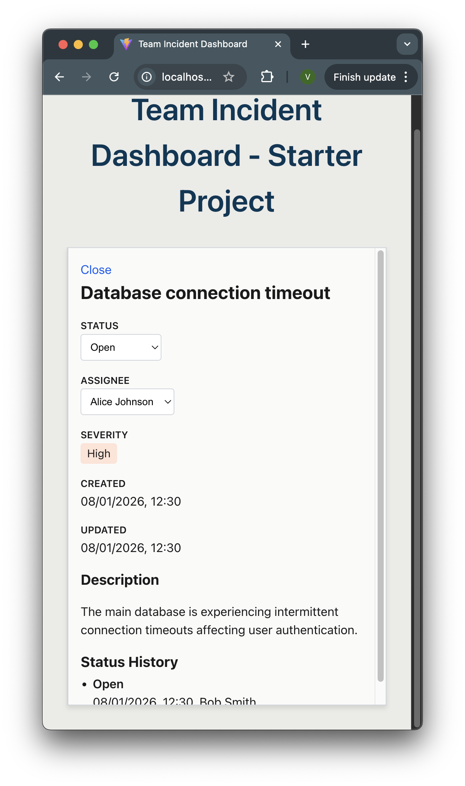
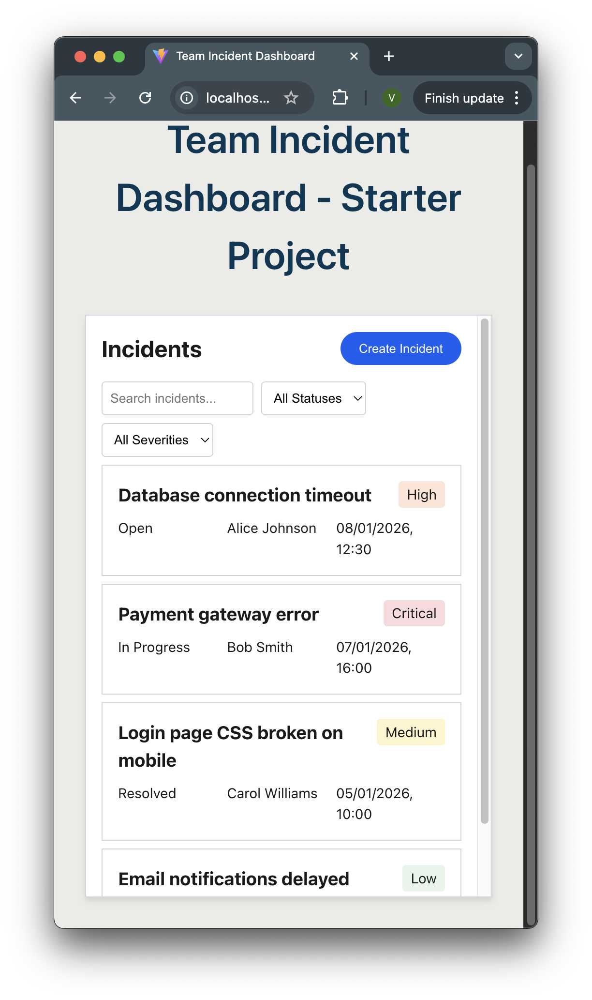
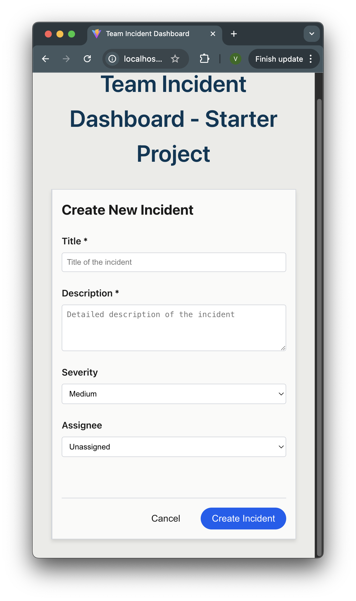

# Team Incident Dashboard - "Complete" Exercise

## Features

- View and filter incidents by status, severity, and title
- Create new incident with basic validation
- Update incident status and assignee
- View incident details and status history
- Optimistic UI updates
- Test coverage for main functionality

## Getting Started

### Prerequisites

- Node.js 18+
- npm or yarn

### Installation & Running

```bash
# Install dependencies
npm install

# Run dev server
npm run dev

# Run tests
npm test

# Build for production
npm run build
```

Open the app at [http://localhost:5173](http://localhost:5173)

## Key decisions

### State management

- Server state: Tanstack Query with centralized keys, optimistic updates, and cache invalidation
- UI state: React `useState` for local component state and view navigation
- Why: I've used Tanstack Query extensively in recent projects and enjoy using it. I find its a clear approach to managing server state

### Data fetching

- All queries and mutations are custom hooks (`useIncidentsQuery`, `useCreateIncidentMutation`, etc)
- Optimistic updates on mutations for quicker UI feedback
- Centralized query keys to prevent types, especially during optimistic updates

### Layout approach

- Side panel design instead of modal or routing
- Mobile size uses a single column and uses grid areas to display the active view
- List remains visible when viewing/editing/creating incident
- Why: Initially sounded simpler, but I struggled at times trying to improve the style and css too much instead of focusing on the features
- Drawback: not possible to share deep URLs

### Component architecture

- Aimed at a feature based organisation, but it is something I would expand more and organise better with more time, at the moment things are separate, but would benefit from some more refactoring
- Idea was to have smart components (using hooks) in the root, and dumb components (props only) inside the components folder
- Improvements: I would probably move to a compound components approach using `useContext`, and at the moment my thought is a context for List, Detail, and Form (or Create/Update) would make sense, but unsure until I implement it

### Testing strategy

- Focused on user interactions, view list, filter list, update and create incident
- Used seed data for assertions, very valuable to already have it there

## Project Structure

```
src/
├── api/                  # Mock API with localStorage persistence
├── components/           # almost only generic UI components (needs improvement)
├── features/Incidents
│   ├── components/               # dumb components
│   ├── hooks/                    # tanstack query hooks
│   ├── IncidenCreateForm.tsx     # create incident view
│   ├── IncidentDetail.tsx        # incident detail view
│   ├── IncidentList.tsx          # incidents list view
│   └── Incidents.tsx             # main container
├── App.css
├── App.test.tsx
├── App.tsx
├── index.css
├── main.tsx
└── vite-env.d.ts
```

## Trade-offs & limitations

What I prioritized:

- Clean architecture and Typescript usage
- Minimal dependencies
- Optimistic updates
- Interesting UI design

What I would improve with more time

- Placement, structure, and composability of components
- Component library (intended to use BaseUI but didn't)
- Utility css (Tailwind)
- Better css modules or a different approach
- Debounce the search input
- Sorting of incidents
- Filter persistence
- Error and success toasts

## Screenshots






## Tooling/AI

- Used Figma Make to create an idea of the layout I intended
- Used a ChatGPT prompt to discuss and decide major points to cover and make an initial plan
- During development used Sonnet 4.5 in Ask mode for issues and questions I have about patterns in React
- Scaffolded the CreateIncident view using Sonnet and adjusted
- Made a list of tests I wanted to cover, created them and debugged issues with the help of Sonnet 4.5

## Overall experience and reflection

I enjoyed this challenge overall, and I learned some lessons about my workflow along the way, as well as gained a bit more experience with React.

### What went well

- Once the foundation was stable, refactoring and adding features was smooth
- I really enjoy using Tanstack Query
- The mock API was very helpful

### What I would do differently

- Less early optimisations. Spent too much time on CSS and design decisions at the start, unsure if I should use BaseUI/Tailwind/Shadcn or not. This slowed initial momentum
- Features first, polish later. Should have build the CRUD features first with basic styling, then refine the UI
- Timeboxing tasks. Setting a time limit for certain tasks would have kept me moving

## Key learning

Getting a working version quickly, even if imperfect, creates a good foundation for iteration than trying to architect everything upfront. The quickness I was able to refactor and implement new components emerged _after_ I had working features to refactor. Refactoring and moving things around is much easier in React than in Vue.

## Mock API

The starter includes a mock API that intercepts `fetch()` requests to `/api/*` endpoints. Data is persisted in localStorage and survives page refreshes.

The mock API is automatically initialized in `main.tsx`.

### Available Endpoints

| Method | Endpoint             | Description            |
| ------ | -------------------- | ---------------------- |
| GET    | `/api/incidents`     | List all incidents     |
| GET    | `/api/incidents/:id` | Get incident by ID     |
| POST   | `/api/incidents`     | Create new incident    |
| PATCH  | `/api/incidents/:id` | Update incident        |
| DELETE | `/api/incidents/:id` | Delete incident        |
| GET    | `/api/users`         | List all users         |
| POST   | `/api/reset`         | Reset data to defaults |

### Usage Example

Use standard `fetch()` calls just like you would with a real REST API:

```typescript
// Fetch all incidents
const response = await fetch("/api/incidents");
const incidents = await response.json();

// Fetch a single incident
const response = await fetch("/api/incidents/inc-1");
const incident = await response.json();

// Create an incident
const response = await fetch("/api/incidents", {
  method: "POST",
  headers: { "Content-Type": "application/json" },
  body: JSON.stringify({
    title: "New issue",
    description: "Description here",
    severity: "Medium",
    assigneeId: "user-1",
  }),
});
const newIncident = await response.json();

// Update an incident
const response = await fetch("/api/incidents/inc-1", {
  method: "PATCH",
  headers: { "Content-Type": "application/json" },
  body: JSON.stringify({
    status: "In Progress",
    assigneeId: "user-2",
  }),
});
const updated = await response.json();

// Delete an incident
await fetch("/api/incidents/inc-1", { method: "DELETE" });

// Get users for assignee dropdown
const response = await fetch("/api/users");
const users = await response.json();

// Reset data to defaults
await fetch("/api/reset", { method: "POST" });
```

### Data Types

```typescript
type IncidentStatus = "Open" | "In Progress" | "Resolved";
type IncidentSeverity = "Low" | "Medium" | "High" | "Critical";

interface Incident {
  id: string;
  title: string;
  description: string;
  status: IncidentStatus;
  severity: IncidentSeverity;
  assigneeId: string | null;
  createdAt: string;
  updatedAt: string;
  statusHistory: StatusHistoryEntry[];
}

interface User {
  id: string;
  name: string;
  email: string;
}
```

## Stack

- **React 18** - UI library
- **TypeScript** - Type safety
- **Vite** - Build tool
- **Vitest** - Testing
- **React Testing Library** - Component testing
- **TanStack Query** - Server state management
